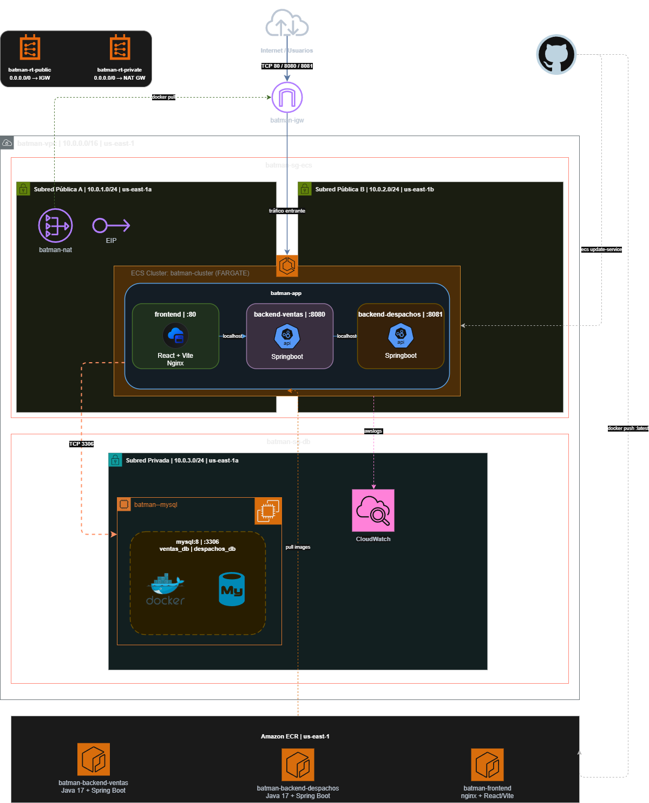

# Devops 2 — Batman Regresa

**Descripción**  
Proyecto DevOps full-stack desplegado sobre AWS con infraestructura gestionada por Terraform. Incluye:

- Frontend React + Vite servido con Nginx.
- Dos APIs REST en Java 17 + Spring Boot (Ventas y Despachos).
- Base de datos MySQL 8 corriendo en Docker sobre una EC2 en subred privada.
- Cluster ECS Fargate como orquestador de contenedores.
- Repositorios de imágenes en Amazon ECR.
- Pipeline CI/CD con GitHub Actions (integración y despliegue continuo).
- Infraestructura como código con Terraform y provider AWS `~> 5.0`.
- Monitoreo de logs centralizado con Amazon CloudWatch.

---

##  Estructura del proyecto

```
Devops_2_BatmanRegresa/
├── .env
├── Docker-compose.yml
├── .github/
│   └── workflows/
│       ├── ci.yml                        # Pipeline de Integración Continua
│       └── cd.yml                        # Pipeline de Despliegue Continuo
├── front_despacho/                       # Frontend React + Vite + Nginx
│   ├── Dockerfile
│   ├── nginx.conf
│   ├── src/
│   │   ├── componentes/
│   │   │   ├── CrudAdmin/
│   │   │   └── Layouts/
│   │   ├── Routes/
│   │   └── __tests__/
│   └── vite.config.js
├── back-Ventas_SpringBoot/               # API REST Ventas (Spring Boot)
│   └── Springboot-API-REST/
│       ├── Dockerfile
│       ├── entrypoint.sh
│       └── src/
├── back-Despachos_SpringBoot/            # API REST Despachos (Spring Boot)
│   └── Springboot-API-REST-DESPACHO/
│       ├── Dockerfile
│       ├── entrypoint.sh
│       └── src/
└── infra/                                # Infraestructura Terraform (AWS)
    ├── main.tf
    ├── variables.tf
    └── outputs.tf
```

---

##  Requisitos

### Despliegue en AWS (Terraform)
- Terraform CLI versión `>= 1.0`
- AWS CLI configurado con credenciales de Contributor o superior
- Suscripción AWS activa con acceso a ECS, ECR, EC2, VPC y CloudWatch
- Key Pair de AWS creado manualmente en la consola (requerido por variable `key_pair_name`)
- Provider Terraform: `hashicorp/aws ~> 5.0`

### Desarrollo local (Docker Compose)
- Docker Desktop o Docker Engine + Docker Compose v2
- Java 17 (para correr los backends sin contenedor)
- Node.js 20 (para correr el frontend sin contenedor)

---

## Diagrama de arquitectura



---

## 📦 ¿Qué despliega este proyecto?

### Infraestructura AWS (Terraform)

**Red (VPC `batman-vpc` | `10.0.0.0/16` | `us-east-1`):**
- Subred Pública A (`10.0.1.0/24`, `us-east-1a`) — aloja los contenedores ECS y el NAT Gateway.
- Subred Pública B (`10.0.2.0/24`, `us-east-1b`) — segunda zona para alta disponibilidad de ECS.
- Subred Privada (`10.0.3.0/24`, `us-east-1a`) — aísla la EC2 con MySQL del tráfico externo.
- Internet Gateway (`batman-igw`) para tráfico entrante público.
- NAT Gateway + EIP para que la subred privada pueda acceder a internet (pull de imágenes Docker).
- Tablas de rutas públicas y privadas.

**Cómputo:**
- **ECS Cluster Fargate** (`batman-cluster`): orquesta la tarea `batman-app` con tres contenedores en un solo task definition.
  - `frontend | :80` — React + Vite + Nginx
  - `backend-ventas | :8080` — Spring Boot API Ventas
  - `backend-despachos | :8081` — Spring Boot API Despachos
- **EC2 en subred privada** (`batman-mysql`): corre MySQL 8 en Docker con las bases de datos `ventas_db` y `despachos_db`.

**Contenedores e imágenes:**
- Amazon ECR con tres repositorios: `batman-backend-ventas`, `batman-backend-despachos` y `batman-frontend`.

**Observabilidad:**
- Amazon CloudWatch para centralizar los logs de los contenedores ECS (driver `awslogs`).

**Seguridad:**
- Security Group `batman-sg-ecs`: controla el tráfico entrante al cluster (puertos 80, 8080, 8081).
- Security Group `batman-sg-db`: restringe el acceso MySQL (TCP 3306) solo desde la VPC.

---

##  Flujo CI/CD (GitHub Actions)

### Integración Continua — `ci.yml`
Se ejecuta en **push o Pull Request** a la rama `develop`. Lanza tres jobs en paralelo:

| Job | Herramienta | Qué valida |
|-----|-------------|------------|
| `test-frontend` | Vitest + Node 20 | Tests unitarios del frontend (CardComponent, Footer, Modal, Navbar) |
| `test-backend-ventas` | JUnit + Maven + Java 17 | `VentaServiceTest` sin levantar contexto Spring |
| `test-backend-despachos` | JUnit + Maven + Java 17 | `DespachoServiceTest` sin levantar contexto Spring |

### Despliegue Continuo — `cd.yml`
Se ejecuta en **push a `main`** (o manualmente con `workflow_dispatch`). Pasos:

1. Configura credenciales AWS desde los Secrets del repositorio.
2. Login en Amazon ECR.
3. Build y push de las tres imágenes Docker con plataforma `linux/amd64`:
   - `batman-backend-ventas:latest`
   - `batman-backend-despachos:latest`
   - `batman-frontend:latest`
4. Fuerza el redespliegue del servicio ECS (`batman-cluster / app`) con `ecs update-service --force-new-deployment`.

### Secrets requeridos en GitHub
```
AWS_ACCESS_KEY_ID
AWS_SECRET_ACCESS_KEY
AWS_SESSION_TOKEN
AWS_ACCOUNT_ID
```

---

## 🖥️ Desarrollo local con Docker Compose

El archivo `Docker-compose.yml` levanta el stack completo localmente:

```bash
# Copia y configura las variables de entorno
cp .env.example .env   # edita los valores si es necesario

# Levanta todos los servicios
docker compose up --build
```

**Servicios levantados:**

| Servicio | Puerto local | Descripción |
|----------|-------------|-------------|
| `mysql_ventas` | 3306 | MySQL 8 — base de datos `ventas_db` |
| `mysql_despachos` | 3307 | MySQL 8 — base de datos `despachos_db` |
| `backend_ventas` | 8080 | API REST Spring Boot — Ventas |
| `backend_despachos` | 8081 | API REST Spring Boot — Despachos |
| `frontend` | 3000 | React + Vite servido por Nginx |

> Los backends esperan a que MySQL esté saludable (`healthcheck`) antes de arrancar.

---

##  Despliegue con Terraform

```bash
# 1. Entra al directorio de infraestructura
cd infra

# 2. Inicializa Terraform
terraform init

# 3. Verifica el plan de cambios
terraform plan \
  -var="key_pair_name=<nombre-de-tu-key-pair>" \
  -var="db_password=<contraseña-mysql>"

# 4. Aplica la infraestructura
terraform apply \
  -var="key_pair_name=<nombre-de-tu-key-pair>" \
  -var="db_password=<contraseña-mysql>"
```

**Outputs útiles tras el apply:**

| Output | Descripción |
|--------|-------------|
| `backend_ventas_ecr_url` | URL del repositorio ECR para el backend Ventas |
| `backend_despachos_ecr_url` | URL del repositorio ECR para el backend Despachos |
| `frontend_ecr_url` | URL del repositorio ECR para el frontend |
| `ec2_private_ip` | IP privada de la EC2 con MySQL (solo accesible desde la VPC) |
| `ecs_cluster_name` | Nombre del cluster ECS creado |

---

##  Mejores prácticas incluidas

- **Separación de responsabilidades**: frontend, backend-ventas y backend-despachos son servicios independientes con sus propios Dockerfiles.
- **Subredes aisladas**: la base de datos vive en una subred privada sin acceso directo desde internet.
- **Variables sensibles protegidas**: `db_password` marcada como `sensitive = true` en Terraform; credenciales AWS gestionadas como Secrets de GitHub.
- **Healthchecks en Docker Compose**: los backends esperan a MySQL antes de iniciar.
- **Multi-AZ**: dos subredes públicas en zonas `us-east-1a` y `us-east-1b` para resiliencia del cluster ECS.
- **Imágenes versionadas por entorno**: pipeline CD etiqueta las imágenes como `:latest` y fuerza redespliegue automático en ECS.
- **Logs centralizados**: todos los contenedores ECS envían logs a CloudWatch con el driver `awslogs`.
- **Rama de integración protegida**: CI corre en `develop`; CD solo se activa desde `main`.

---

##  Repositorio

> [https://github.com/josemiguelpenalozas/Devops_2_BatmanRegresa](https://github.com/josemiguelpenalozas/Devops_2_BatmanRegresa)