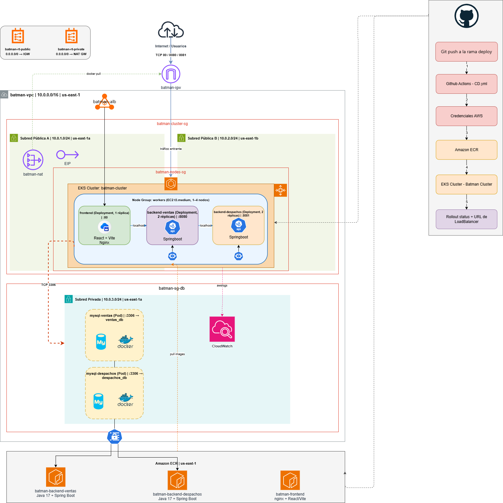

# Devops 2 — Batman Regresa

**Descripción**  
Proyecto DevOps full-stack desplegado sobre **Amazon EKS (Elastic Kubernetes Service)**, con infraestructura gestionada por Terraform. El objetivo del proyecto es migrar un stack de contenedores desde una orquestación basada en ECS Fargate hacia un clúster de **Kubernetes gestionado en AWS**, incorporando prácticas propias de Kubernetes como Services, Secrets, autoescalado horizontal (HPA) y despliegues declarativos vía manifests YAML.

El stack incluye:

- Frontend React + Vite servido con Nginx.
- Dos APIs REST en Java 17 + Spring Boot (Ventas y Despachos).
- Dos bases de datos MySQL 8 (`ventas_db` y `despachos_db`), cada una corriendo como un Deployment independiente dentro del clúster.
- Clúster **Amazon EKS** como orquestador de contenedores, con un Node Group de instancias EC2 worker.
- Repositorios de imágenes en Amazon ECR.
- Pipeline CI/CD con GitHub Actions: integración continua (tests) y despliegue continuo (build, push a ECR y `kubectl apply` sobre el clúster EKS).
- Infraestructura como código con Terraform y provider AWS `~> 5.0`.
- Autoescalado horizontal de los backends con `HorizontalPodAutoscaler` (HPA).
- Credenciales de base de datos gestionadas como `Secret` de Kubernetes.

---

## Estructura del proyecto

Devops_2_BatmanRegresa/
├── .env
├── Docker-compose.yml
├── Diagrama_Devops.png
├── .github/
│   └── workflows/
│       ├── ci.yml                        # Pipeline de Integración Continua
│       └── cd.yml                        # Pipeline de Despliegue Continuo (build + push ECR + deploy a EKS)
├── front_despacho/                       # Frontend React + Vite + Nginx
│   ├── Dockerfile
│   ├── nginx.conf
│   ├── src/
│   │   ├── componentes/
│   │   │   ├── CrudAdmin/
│   │   │   └── Layouts/
│   │   ├── Routes/
│   │   └── tests/
│   └── vite.config.js
├── back-Ventas_SpringBoot/               # API REST Ventas (Spring Boot)
│   └── Springboot-API-REST/
│       ├── Dockerfile
│       ├── entrypoint.sh
│       └── src/
├── back-Despachos_SpringBoot/            # API REST Despachos (Spring Boot)
│   └── Springboot-API-REST-DESPACHO/
│       ├── Dockerfile
│       ├── entrypoint.sh
│       └── src/
└── infra/
├── terraform/                        # Infraestructura como código (AWS + EKS)
│   ├── main.tf                       # Provider AWS y configuración de Terraform
│   ├── variables.tf                  # Variables (región, nombre del proyecto)
│   ├── vpc.tf                        # VPC, subredes públicas, IGW y route tables
│   ├── eks.tf                        # Cluster EKS + Node Group de workers
│   ├── security_groups.tf            # Security Groups del cluster y de los nodos
│   ├── iam.tf                        # Rol IAM (LabRole de AWS Academy)
│   ├── ecr.tf                        # Repositorios ECR para las 3 imágenes
│   └── outputs.tf                    # Outputs (URLs de ECR, nombre y endpoint del cluster)
└── k8s/                              # Manifests de Kubernetes aplicados sobre EKS
├── frontend.yml                  # Deployment + Service (LoadBalancer) del frontend
├── backend-ventas.yml            # Deployment + Service del backend Ventas
├── backend-despachos.yml         # Deployment + Service del backend Despachos
├── mysql-ventas.yml               # Deployment + Service de MySQL (ventas_db)
├── mysql-despachos.yml            # Deployment + Service de MySQL (despachos_db)
├── secret_backend_ventas.yml      # Secret con credenciales DB del backend Ventas
├── secret_backend_despachos.yml   # Secret con credenciales DB del backend Despachos
└── hpa.yml                        # HorizontalPodAutoscaler para ambos backends

---

## Requisitos

### Despliegue en AWS (Terraform + EKS)
- Terraform CLI versión `>= 1.0`
- AWS CLI configurado con credenciales (AWS Academy LabRole o equivalente con permisos sobre EKS, EC2, VPC y ECR)
- `kubectl` instalado para interactuar con el clúster una vez desplegado
- Provider Terraform: `hashicorp/aws ~> 5.0`

### Desarrollo local (Docker Compose)
- Docker Desktop o Docker Engine + Docker Compose v2
- Java 17 (para correr los backends sin contenedor)
- Node.js 20 (para correr el frontend sin contenedor)

---

## Diagrama de arquitectura



---

## ¿Qué despliega este proyecto?

### Infraestructura AWS (Terraform)

**Red (VPC `batman-vpc` | `10.0.0.0/16` | `us-east-1`):**
- Subred Pública A (`10.0.1.0/24`, `us-east-1a`).
- Subred Pública B (`10.0.2.0/24`, `us-east-1b`) — segunda zona para alta disponibilidad del clúster EKS.
- Internet Gateway (`batman-igw`) para tráfico entrante público.
- Tabla de rutas pública asociada a ambas subredes.

**Cómputo — Amazon EKS:**
- **Cluster EKS** (`batman-cluster`), desplegado sobre las dos subredes públicas para tolerancia a fallos multi-AZ.
- **Node Group** (`workers`) de instancias EC2 `t3.medium`, con autoescalado entre 1 y 4 nodos (`desired_size = 2`).
- **Pods desplegados dentro del clúster:**
  - `frontend` — React + Vite + Nginx, expuesto vía Service tipo `LoadBalancer` (puerto 80).
  - `backend-ventas` — Spring Boot API Ventas (puerto 8080), 2 réplicas, Service `ClusterIP`.
  - `backend-despachos` — Spring Boot API Despachos (puerto 8081), 2 réplicas, Service `ClusterIP`.
  - `mysql-ventas` y `mysql-despachos` — MySQL 8 en pods independientes con su propio Service `ClusterIP`, cada uno con su base de datos (`ventas_db` / `despachos_db`).

**Contenedores e imágenes:**
- Amazon ECR con tres repositorios: `batman-backend-ventas`, `batman-backend-despachos` y `batman-frontend`, con escaneo de vulnerabilidades activado (`scan_on_push`).

**Seguridad:**
- Security Group `batman-cluster-sg`: protege el plano de control del clúster EKS.
- Security Group `batman-nodes-sg`: controla el tráfico hacia los nodos worker (HTTP/HTTPS, rango de NodePort de Kubernetes y comunicación interna con el plano de control).
- Credenciales de las bases de datos gestionadas como `Secret` de Kubernetes (`backend-ventas-secret`, `backend-despachos-secret`), inyectadas como variables de entorno en cada backend.

**Autoescalado:**
- `HorizontalPodAutoscaler` para `backend-ventas` y `backend-despachos`: entre 2 y 5 réplicas, escalando al 50% de utilización de CPU.

---

## Flujo CI/CD (GitHub Actions)

### Integración Continua — `ci.yml`
Se ejecuta en **push o Pull Request** a la rama `develop`. Lanza tres jobs en paralelo:

| Job | Herramienta | Qué valida |
|-----|-------------|------------|
| `test-frontend` | Vitest + Node 20 | Tests unitarios del frontend (CardComponent, Footer, Modal, Navbar) |
| `test-backend-ventas` | JUnit + Maven + Java 17 | `VentaServiceTest` sin levantar contexto Spring |
| `test-backend-despachos` | JUnit + Maven + Java 17 | `DespachoServiceTest` sin levantar contexto Spring |

### Despliegue Continuo — `cd.yml`
Se ejecuta en **push a `deploy`** (o manualmente con `workflow_dispatch`). Pasos:

1. Configura credenciales AWS desde los Secrets del repositorio.
2. Login en Amazon ECR.
3. Build y push de las tres imágenes Docker (`linux/amd64`), etiquetadas con el SHA del commit:
   - `batman-backend-ventas:<sha>`
   - `batman-backend-despachos:<sha>`
   - `batman-frontend:<sha>`
4. Instala `kubectl` y configura el `kubeconfig` apuntando al clúster EKS (`aws eks update-kubeconfig`).
5. Aplica todos los manifests de Kubernetes (`kubectl apply -f infra/k8s/`).
6. Actualiza la imagen de cada Deployment (`kubectl set image`) con el nuevo tag del commit.
7. Espera el rollout de los tres Deployments (`kubectl rollout status`).
8. Obtiene la URL pública del frontend a través del `LoadBalancer` del Service.

### Secrets requeridos en GitHub

AWS_ACCESS_KEY_ID
AWS_SECRET_ACCESS_KEY
AWS_SESSION_TOKEN

---

## Desarrollo local con Docker Compose

El archivo `Docker-compose.yml` levanta el stack completo localmente:

```bash
# Copia y configura las variables de entorno
cp .env.example .env   # edita los valores si es necesario

# Levanta todos los servicios
docker compose up --build
```

**Servicios levantados:**

| Servicio | Puerto local | Descripción |
|----------|-------------|-------------|
| `mysql_ventas` | 3306 | MySQL 8 — base de datos `ventas_db` |
| `mysql_despachos` | 3307 | MySQL 8 — base de datos `despachos_db` |
| `backend_ventas` | 8080 | API REST Spring Boot — Ventas |
| `backend_despachos` | 8081 | API REST Spring Boot — Despachos |
| `frontend` | 3000 | React + Vite servido por Nginx |

> Los backends esperan a que MySQL esté saludable (`healthcheck`) antes de arrancar.

---

## Despliegue con Terraform + Kubernetes

```bash
# 1. Entra al directorio de infraestructura
cd infra/terraform

# 2. Inicializa Terraform
terraform init

# 3. Verifica el plan de cambios
terraform plan

# 4. Aplica la infraestructura (crea VPC, EKS, Node Group, Security Groups y ECR)
terraform apply

# 5. Conecta kubectl al clúster EKS recién creado
aws eks update-kubeconfig --region us-east-1 --name batman-cluster

# 6. Aplica los manifests de Kubernetes
kubectl apply -f ../k8s/

# 7. Verifica que todo esté corriendo
kubectl get pods
kubectl get svc frontend
```

**Outputs útiles tras el apply:**

| Output | Descripción |
|--------|-------------|
| `backend_ventas_ecr_url` | URL del repositorio ECR para el backend Ventas |
| `backend_despachos_ecr_url` | URL del repositorio ECR para el backend Despachos |
| `frontend_ecr_url` | URL del repositorio ECR para el frontend |
| `eks_cluster_name` | Nombre del cluster EKS creado |
| `eks_cluster_endpoint` | Endpoint del API server del cluster EKS |

---

## Mejores prácticas incluidas

- **Separación de responsabilidades**: frontend, backend-ventas y backend-despachos son servicios independientes, cada uno con su propio Deployment y Service.
- **Bases de datos aisladas por dominio**: `mysql-ventas` y `mysql-despachos` corren como pods independientes, cada uno accesible solo internamente vía `ClusterIP`.
- **Credenciales protegidas**: usuario, contraseña y nombre de base de datos gestionados como `Secret` de Kubernetes en vez de variables de entorno planas.
- **Autoescalado horizontal**: HPA en ambos backends (2 a 5 réplicas según uso de CPU).
- **Multi-AZ**: el clúster EKS y su Node Group se distribuyen en dos subredes públicas (`us-east-1a` y `us-east-1b`) para resiliencia.
- **Security Groups dedicados**: uno para el plano de control del clúster y otro para los nodos worker, con reglas explícitas de entrada/salida.
- **Imágenes versionadas por commit**: el pipeline CD etiqueta cada imagen con el SHA del commit y actualiza el Deployment correspondiente (`kubectl set image`).
- **Rollout controlado**: el pipeline espera (`kubectl rollout status`) a que cada Deployment termine su actualización antes de continuar.
- **Rama de integración protegida**: CI corre en `develop`; CD solo se activa desde `deploy`.

---

## Repositorio

> [https://github.com/josemiguelpenalozas/Devops_2_BatmanRegresa](https://github.com/josemiguelpenalozas/Devops_2_BatmanRegresa)